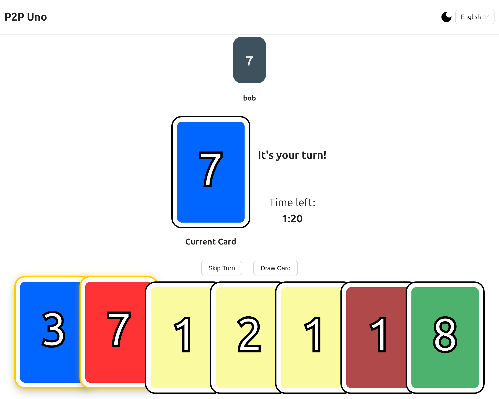
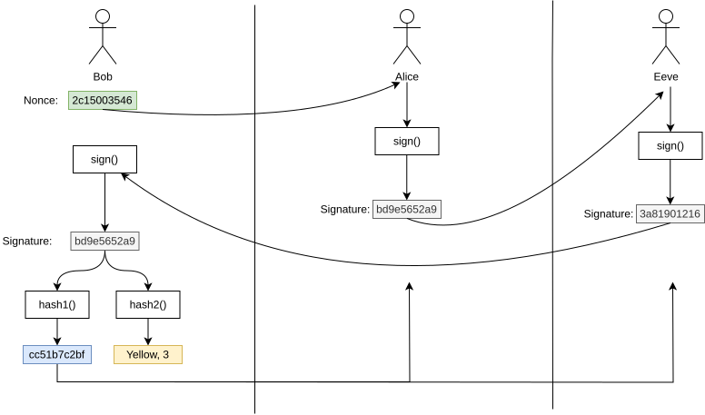

# P2P Uno

A peer-to-peer clone of the popular UNO game implementing a custom cryptographic protocol to avoid cheating.
It implemented using TypeScript + React. The P2P communication is done via WebRTC Datachannels.

<p align="center">
    
</p>

This project was developed in the context of the Distributed Systems course at the University of Bologna. The code in this repository is only part of a larger system that is fully specified in .

## Cryptographic Protocol

### Card Drawing

Assume we have three players: Bob, Alice and Eeve. Bob wants to draw a card.

- Bob generates a random nonce using a secure random generator
- Bob sends the nonce to Alice and Eeve
- Alice signs the nonce and sends the signature to Bob and Eeve
- Eeve signs the signature of Alice and distributes the result among the other players
- Finally bob signs Eeves signature but only publishes a hash of their signature for now. This final signature is used to determine the type of the card that has been drawn



## Playing Cards

When playing a card, the player now simply publishes the last signature of the signature chain. This allows the other players to verify that:

- The final signature is valid.
- The card matches the previously published hash.
- It is allowed to play the card in the current state.

## Getting started

### Docker

We provide a docker image for quick setup and deployment.
After cloning the repository, simply run the following command in the project root directory:

```bash
docker-compose run --build
```

Now the frontend should be available under [http://localhost:8080](http://localhost:8080).

### Manual Setup

Requirements:

- git
- [uv](https://docs.astral.sh/uv/)
- [npm](https://www.npmjs.com/) or similar

1. Clone the repository
2. Run `uv sync`
3. Compile the frontend package:

```bash
cd src/p2p_uno/frontend
npm install && npm run build
```

4. Generate a keypair for the matchmaking server:

```bash
uv run uno-mms gen-keypair --out key.priv --pub key.pub
```

5. Start the matchmaking server

```bash
uv run uno-mms start --host 0.0.0.0 --port 8000
```

6. Create a matchmaking server config file containing all the running matchmaking servers. An example configuration can be found in [mm_server_config_example.yaml](mm_server_config_example.yaml).

```yaml
test_instance:
    name: Local 1
    url: localhost:8000
    secure: false
    public_key: ./key.pub
```

7. Start a server instance that servers the frontend:

```bash
uv run uno-frontend --host 0.0.0.0 --port 8080 --matchmaking-config mm_config.yaml
```

Now the user interface is available under [http://localhost:8080](http://localhost:8080).

## Project Structure

This project is structured as a top-level python project that is managed by uv.
The [src](src) directory contains all the source code of the application.
The code for the frondend and peer implementation for the games can be found as an npm project in [src/p2p_uno/frontend](src/p2p_uno/frontend).

# Future Work

## Blockchain based action signing
One remaining problem of this approach is that this system is still vulnerable to sybil attacks. One way to fix this could be to implement a system where a blockchain is built from the game history where each action (drawing card, playing card, skipping, etc.) is represented as a block, signed by the player that executed this action. This blockchain can then later be validated by a server that manages winning statistics, which can then validate the whole action history and detect cheating.

This ensure further resistence towards cheaters while not further hardening the dependencies on any centralized servers.
